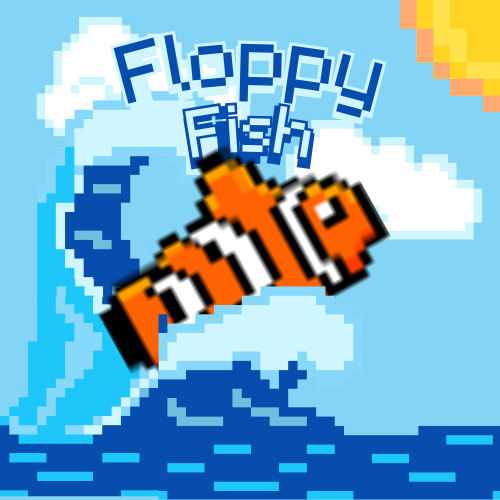

# Floppy Fish

Floppy Fish is an adaptation of the game Flappy Bird.

Your mission is to swim through the ocean and avoid obstacles as best as you can!

## Instructions

1. Clone the repository.
2. Install dependencies with `npm install`.
3. Start the development server with `npm run dev`.

